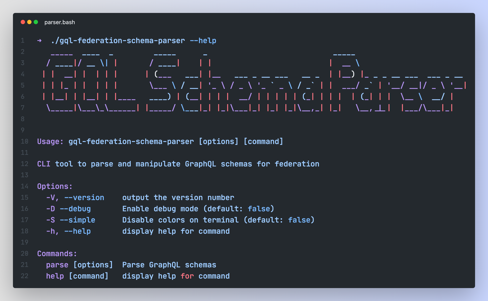

# GraphQL Federation Schema Parser


[](https://www.npmjs.com/package/@tiagoboeing/gql-federation-schema-parser)



This project provides a CLI tool to parse GraphQL schemas and generate TypeScript definitions for use in a GraphQL Federation gateway.

Run it on a directory containing GraphQL schema files, and it will output TypeScript definitions to publish to Schema Registry. All schema files will be parsed and merged into a single schema scoped by a provided namespace and service name.

For what purpose should you use this tool?
- Building a **GraphQL supergraph**: Use it to create a federated schema for a GraphQL gateway, allowing you to combine multiple services into a single schema and namespace them properly.

| Feature                  | Description                                                       | Supported |
| ------------------------ | ----------------------------------------------------------------- | --------- |
| Recursive schema parsing | Parses all `.graphql` files in a directory and its subdirectories | ✅         |

## Usage

### Commands

- `parse`: Parses GraphQL schema files and generates TypeScript definitions.
- `help`: Displays help information for the CLI tool.

To get help on the CLI, run `--help` or `-h` on any command:

```bash
gql-federation-schema-parser --help
# or
gql-federation-schema-parser -h

# On a specific command
gql-federation-schema-parser parse --help
# or
gql-federation-schema-parser parse -h
```

### Debug mode

You can enable debug mode to see detailed logs of the parsing process. This is useful for troubleshooting issues with schema files or understanding how the tool works.

Use `-D` or `--debug` on any command to enable global debug mode:

```bash
gql-federation-schema-parser parse -d ./schemas -s myService -n myScope -D
# or
gql-federation-schema-parser parse -d ./schemas -s myService -n myScope --debug
```

> [!NOTE]
>
> Debug mode is a global setting and will apply to all commands. It will log detailed information about the parsing process, including file paths, and other relevant information.

## How it works

With the following [schema files](./schemas) in a directory and these settings:

- `--service-name`: `users`
- `--namespace`: `platform`

The resulting GraphQL schema will be:

```graphql
# Graphql root definitions
directive @oneOf on INPUT_OBJECT

scalar ID
scalar String
scalar Boolean

type PlatformUsers__Post {
  id: ID!
  content: String
  authorId: ID!
}

type PlatformUsers__User {
  id: ID!
  name: String
  email: String
}

type PlatformUsersQueries {
  posts: [PlatformUsers__Post!]!
  post(id: ID!): PlatformUsers__Post
  users: [PlatformUsers__User!]!
  getSubschemaData: String
}

type PlatformUsersMutations {
  createPost: PlatformUsers__Post!
}

type PlatformMutations {
  users: PlatformUsersMutations!
}

type PlatformQueries {
  users: PlatformUsersQueries!
}

type Mutation {
  platform: PlatformMutations!
}

type Query {
  platform: PlatformQueries!
}
```

In gateway you can query the schema like this:

```graphql
query {
  platform {
    users {
      # Query, mutate or subscribe to your service operations
      ...
    }
  }
}
```

All GraphQL types will be prefixed with the namespace and service name, allowing you to have multiple services under the same namespace without conflicts. Eg.: `PlatformUsers__User`, `PlatformUsers__Post`, etc.

### Where to use this tool

Use this CLI at the service level to prepare schema before publish it to the Schema Registry. It will generate a final GraphQL Schema file with the merged definitions. The gateway need to be prepared to translate the namespace and service name into the correct GraphQL operations at the service level.

> [!NOTE]
>
> Example: on Yoga/Hive gateway, you can create a custom plugin to handle `onFetch` hook, capture the namespace and service name, and translate the query to the correct service operation overriding the `setFetchFn()` method.

## Installation

You can install the `gql-federation-schema-parser` CLI tool using one of the following methods:

- Using NPM
- On any platform with the pre-built binary

### Using NPM

To install the CLI tool globally using NPM, run:

```bash
npm install -g @tiagoboeing/gql-federation-schema-parser
# or
pnpm install -g @tiagoboeing/gql-federation-schema-parser
```

After install, run:

```bash
gql-federation-schema-parser --help
```

### Pre-built Binary

#### MacOS

On MacOS a warn will be shown when running the binary for the first time, indicating that it is from an unidentified developer. You can bypass this by following these steps:

```bash
# Download the latest release from the release page and unzip it
...

# Trust the binary and make it executable
xattr -d com.apple.quarantine gql-federation-schema-parser-macos
chmod +x gql-federation-schema-parser-macos

# Run the binary
./gql-federation-schema-parser-macos --help
```

#### Linux

On Linux, you can download the pre-built binary from the release page and run it directly:

```bash
# Download the latest release from the release page and unzip it
...
chmod +x gql-federation-schema-parser-macos

# Run the binary
./gql-federation-schema-parser-macos --help
```

## Development

To develop this project, you will need Node.js and npm installed. Follow these steps to set up the development environment:

### Testing CLI

To test the CLI, you can use `tsx` script on `package.json` to run the TypeScript code directly and debug in your IDE:

```bash
pnpm start:dev-ts src/index.ts [args]
```

> [!NOTE]
>
> On VSCode, run from a JavaScript Debug Terminal to enable debugging features like breakpoints and watch variables.

or you can use `bun` to run the TypeScript code (Bun debugger is buggy, so use it only if you don't need to debug):

```bash
pnpm start:dev 
# or
bun --watch src/index.ts

# Pass arguments to the script
pnpm start:dev ...args
# Example:
pnpm start:dev parse -d ./schemas -s users -n platform
```